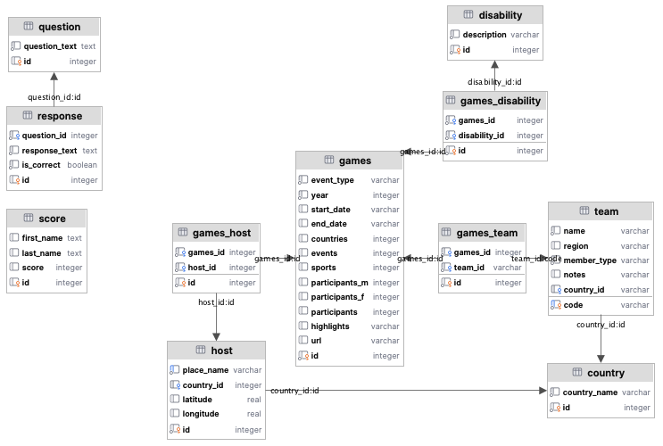

# 1. Introduction to creating charts with Plotly Express and Go

## Introduction

In this tutorial you will learn to create and add charts to an app. The approach for this varies
by framework, so where there are variants of an activity, please follow the version for your
chosen framework.

## Plotly graphing library for Python

The Plotly graphing library for Python has two packages within it, Plotly Express and Plotly Go.

Plotly Express provides Python classes and functions to create most types of charts, and in most
cases will be enough for the coursework.

If you need to edit aspects of a chart that are not available through Express functions, use Go
instead.

Many of the chart examples in the [Plotly documentation](https://plotly.com/python/) start with an
Express example, then show features that require Go. They also include a version that can be added
to a Dash app.

## Choosing the type of chart

The Plotly documentation shows examples of code for many types of chart. However, this assumes you
already know the type of chart you want to create. To help you decide which type of chart may be
suited to your particular data and audience, try one of the following:

- [Data Visualisation Catalogue](https://datavizcatalogue.com/search.html)
- [Depict Data Studio](https://depictdatastudio.com/charts/)
- [Page with links to other chart choosers](https://coolinfographics.com/dataviz-guides)

## Plotly Express

Plotly Express is a high-level API built on top of Plotly Graph Objects. Express is typically more
convenient to use. Plotly recommends using this, unless it does not support the chart type you want
to create.

You can often create a chart with a single line of code with Express:

```python
import pandas as pd
import plotly.express as px

df = pd.read_csv("my_data.csv")
line_chart = px.line(df, x="year", y="count", title="My chart title")
```

You can [style](https://plotly.com/python/styling-plotly-express/) the chart using the following
approaches, examples are included in the remaining
activities:

- Control common parameters like width and height, titles, labelling and colours using built-in
  Plotly Express function arguments.
- Update the figure attributes using or by directly setting attributes.
- Use Plotly's theming/templating mechanism
- Set default values for common parameters using `px.defaults`

## Plotly Go

Plotly Graph Objects is a low-level API with Python classes that represent part of a figure.

There are three main concepts in Plotly’s philosophy:

**Data** (traces): The Data object defines what we want to display in the chart (that is, the data).
You define a collection of data and the specifications to display them as a trace. A Data object can
have many traces. Think of a line chart with two lines representing two different categories: each
line is a trace.

**Layout**: The Layout object defines features that are not related to data (like title, axis
titles, and so on). You can also use the Layout to add annotations and shapes to the chart.

**Figure**: The Figure object creates the final object to be plotted. It's an object that contains
both data and layout.

For example:

```python
import plotly.graph_objects as go

fig = go.Figure(
    data=[go.Bar(x=[1, 2, 3], y=[1, 3, 2])],
    layout=go.Layout(height=600, width=800)
)
```

## Creating a chart

The general approach to creating a chart and adding it to a web app is:

1. Access the required data, e.g. from:

    - sqlite database
    - .csv/.xlsx file
    - REST API in JSON format
2. Manipulate the data in a Pandas dataframe
3. Create a chart object using the dataframe data
4. Add the chart to a page in your web app

## Accessing the data

The data is in [src/data](../../src/data) with two formats:

1. `paralympics.db` SQLite database with the following tables:

    

2. `paralympics.xlsx` a spreadsheet with the following columns:

```text
type	        e.g. winter, summer
year
country_code    3 digit code
country_name	
host	        city name
start	
end	
disabilities_included	
countries	    number of countries that participated
events	        number of medal events
sports	    n   umber of different sports
participants_m	number of male participants
participants_f	number of female participants
participants	total participants
highlights	
URL             URL to paralympics page on the IPC website
latitude        latitude of the host city
longitude       longitude of the host city
```

There is code that returns both in JSON format in [
`mock_api.py`](../../src/data/mock_api.py):

- `def get_event_data()` reads the Excel table and returns the rows as JSON
- `class MockAPI()` has functions that each reads all rows from one of the tables abd returns the
  rows as JSON
- `app=FastAPI()` this section uses the MockAPI class and creates a REST API app with a route to get
  the data for each table as JSON, and a route that gets most of the same fields as the spreadsheet

### Copy the data and run the REST API

Copy the `data` package with `__init__.py`, `mock_api.py`, and `paralympics.db` to your app folder
structure.

Run the REST API, either run the `main` at the end of the python file in your IDE or
run from the terminal e.g. `python src/data/mock_api.py`.

The API should run on http://127.0.0.1:8000.

Go to the URL and try out the links in the documentation. This is a very basic FastAPI app, you
will create a more functional version in coursework 2. You could use a similar structure to create
a temporary backend for your coursework 1.

Leave the API running.

### Action: Create a function to access the data

1. To allow you to re-use the code, the code for each chart will be written as a
   function. Create a new Python module in your project directory structure, e.g. `charts.py`.

2. Create a function to get the data from a REST API into a pandas DataFrame

In your `charts.py` add a function that:

- Makes an HTTP request to the API to get all the paralympics data using Python requests and the
  url http://127.0.0.1:8000/all
- If successful, the request should return JSON data
- Create a pandas DataFrame with the JSON data
- Return the DataFrame from the function

For example, here is my solution:

```python
import requests
import pandas as pd


def get_api_data(url):
    """ Gets the JSON data from the mock_api REST API

    Args:
        url: URL for the REST API route, e.g. http://127.0.0.1:8000/all

    Returns:
        df: DataFrame with the data
    """
    response = requests.get(url)
    response.raise_for_status()
    data = response.json()
    df = pd.DataFrame(data)
    return df
```

You will need this function in activity 2.

Note: `response.raise_for_status()`. If the HTTP response status code is 200–399,
`.raise_for_status()` does nothing and execution continues.
If the status code is 400–599, it raises `requests.exceptions.HTTPError` (the exception message
includes the status code and URL).

[Next activity](2-create-charts.md)