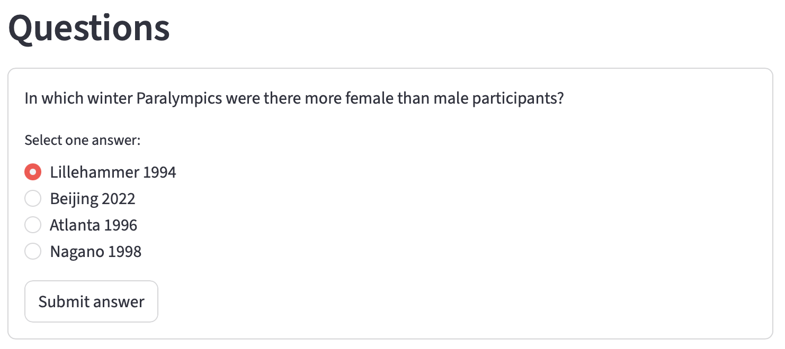

# 2. Adding a form to a Streamlit app

## Before you start

Make sure you have the latest versions of the following files from
the [tutorials repository](https://github.com/nicholsons/comp0034-tutorials-2025/tree/master/src/data):

- `data.py` the ParalympicsData class has moved out of mock_api.py to this module
- `mock_api.py` updated to include more routes
- `paralympics.db` this has questions and responses in the database

Make sure the API is running. Run in Python `src/data/mock_api.py`.

The API by default will be available at http://127.0.0.1:8000

## Overview

This activity gets multiple choice questions from the database via the REST API, captures a user's
response and checks if the answer is correct. It replaces the placeholder form from last week

It will look like this:



One question at a time will be presented to the user with a `Submit` button.

The first question will be shown when the script is first run.

If answer correctly, they move to the next question, if not, they keep repeating until it is
correct. Repeat for all questions then end.

## Add helper functions to get the data from the REST API
As you need to make repeated called the REST API, suggest writing the code as functions that can be
reused.

You can copy and paste mine, or write your own.

You can either add to the `app.py` or create a new module and import the functions.

To get the data from the REST API you need a library that can send an HTTP request, and get the 
JSON returned in the HTTP response. The Python `requests` library does this.

```python
from typing import Any, Dict, List
import requests
import streamlit as st

API_BASE = "http://127.0.0.1:8000"  # REST API default URL
TIMEOUT = 5  # seconds


# Helper functions for interacting with the REST API

def _get(url: str, **kwargs) -> requests.Response:
    """HTTP GET with a uniform timeout and error handling."""
    try:
        resp = requests.get(url, timeout=TIMEOUT, **kwargs)
        resp.raise_for_status()
        return resp
    except requests.exceptions.RequestException as e:
        raise RuntimeError(f"Request failed for {url}: {e}") from e


@st.cache_data(show_spinner=False)
def count_questions() -> int:
    """Return the number of questions available."""
    resp = _get(f"{API_BASE}/question")
    data = resp.json()
    return len(data)


@st.cache_data(show_spinner=False)
def get_question(qid: int) -> Dict[str, Any]:
    """Return the question object by ID."""
    resp = _get(f"{API_BASE}/question/{qid}")
    return resp.json()


@st.cache_data(show_spinner=False)
def get_responses(qid: int) -> List[Dict[str, Any]]:
    """Return the responses for a given question ID."""
    resp = _get(f"{API_BASE}/response/search", params={"question_id": qid})
    return resp.json()
```

## Replace the form added last week

Replace the form added last week with a function that will generate the multiple-choice questions
and handle the logic when an answer is submitted.

Remove this block:

Replace with something like this (use any function name you wish):

```python
# Questions
question_container = st.container()
with question_container:
    render_question_block()
```

Note that you have not yet written `render_question_block()` so your IDE will display a warning!

## Write the render_question_block() function

Add this helper function, either in `app.py` or in a separate module.

The code will make use of the `st.session_state` that you used last week to store dropdown 
selections. This time you will keep the current question number. To check if this is set and set it 
if not:

```python
    if "q_index" not in st.session_state:
        st.session_state.q_index = 1

    q_index = st.session_state.q_index
```

Next find out how many questions there are in the database using the helper function added earlier:

```python
    # Fetch total count
    num_q = count_questions()
```

Find out if the question id is greater than the total number of questions, if it is then show a
message to say they have completed the questions and return. For example:

```python
# If past the last question, show completion and exit
    if q_index > num_q:
        st.success("Questions complete, well done!")
        return
```

Otherwise, if the question number is less than or equal to the total number of questions, get the 
question JSON and the responses JSON for that question. Once you have the data, then create a
form with radio buttons:

```python
# Fetch the current question + its responses
    q = get_question(q_index)
    responses = get_responses(q_index)
    
    # Build radio options as label -> id map
    label_to_id = {r.get("response_text", ""): r.get("id") for r in responses if
                   r.get("response_text", "")}

    with st.form(key="quiz_form", clear_on_submit=False):
        st.write(q.get("question_text", ""))
        selected_label = st.radio(
            "Select one answer:",
            options=list(label_to_id.keys()),
            index=None,
        )
        submitted = st.form_submit_button("Submit answer")
```

Now you have the question you need to provide the logic to check if the response is correct or 
not once the button is clicked:

```python
    # Handle submission
    if submitted:
        if not selected_label:
            st.info("Please select an answer.")
            return

        selected_id = str(label_to_id[selected_label])

        # Find the selected response to inspect correctness
        selected_obj = next(
            (r for r in responses if str(r.get("id")) == selected_id),
            None,
        )

        if selected_obj and selected_obj.get("is_correct"):
            # Advance or finish
            if q_index >= num_q:
                st.session_state.q_index = num_q + 1
                st.success("Questions complete, well done!")
            else:
                st.session_state.q_index = q_index + 1
                # Using rerun ensures the next question renders cleanly
                st.rerun()
        else:
            st.info("Please try again!")
```

Run the script and try it out. Don't forget to make sure that the REST API is running first!

## Ideas to extend the solution

You could try to enhance it, e.g.:

- allow the questions to be restarted
- capture their responses and calculate a score
- capture their result and save it to the database (you may need a new table in the database)

[Next activity]()