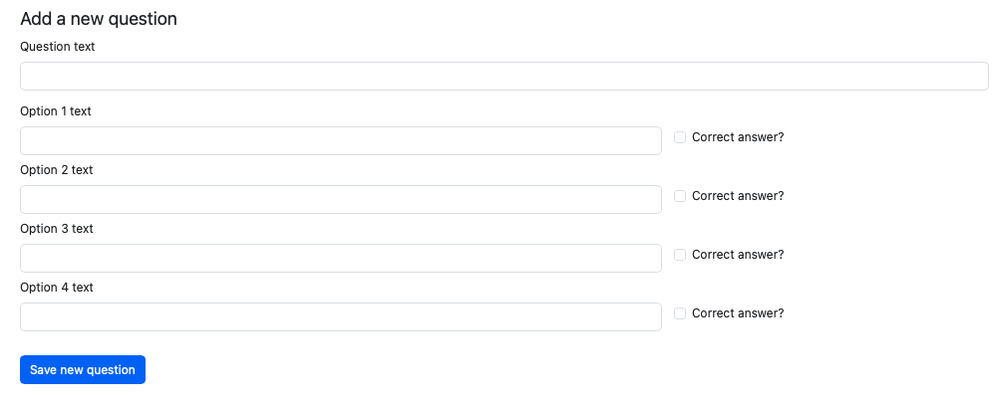

# 3. Using a form to submit data to the REST API (Flask)

This activity will add a new admin page to the app to allow a teacher to add new questions and
responses.

It uses a form and POST HTTP requests to the REST API.

Code is only shown for new concepts.

## Add a form class

Create a form class to allow a teacher to add a new multiple choice question with 4 potential
answers, only one of which is correct.

It should have:

- 1 `StringField()` for the question text
- 4 x `StringField()` for each option text
- 4 x `BooleanField()` for each option to indicate if it is the correct answer or not
- A `SubmitField()` to save the new question to the database

## Add a template to render the form

Add a new jinja template that inherits from base and implements the form.

The form would look something like this:


Hint: add a custom validator to the form class that checks that one and only one checkbox is
selected

```python
    def validate(self, extra_validators=None):
        # Run field validators first (and forward any extra validators)
        valid = super().validate(extra_validators=extra_validators)
        if not valid:
            return False
        
        correct_flags = [
            self.is_correct_1.data,  # The BooleanField is named is_correct_1 in the form class
            self.is_correct_2.data,
            self.is_correct_3.data,
            self.is_correct_4.data,
        ]
        correct_count = sum(bool(x) for x in correct_flags)
        
        if correct_count != 1:
            msg = "Select exactly one correct answer."
            # Attach to all checkboxes so the error is visible next to them
            for f in (self.is_correct_1, self.is_correct_2, self.is_correct_3, self.is_correct_4):
                f.errors.append(msg)
            return False
        
        return True
```

## Add the route logic to render the form

Add a new route that supports GET and POST methods.

Create an instance of the form class and pass to the template.

Don't forget to update the navbar to add the new route!

Run the app and check the form displays.

## Add the submission logic to the form

If the form passes validation on submit.

Get the values from the form.

Use the values to create JSON for the question.

Save the question to the database using the REST API

Get the id of the saved question from the HTTP response.

Create the JSON for each response (option). Get the response_text and is_correct from the form data,
and the question_id from the id you just got from saving the question.

Save the responses (options) to the database.

Flash messages if any error or to advise success.

Return to the add new question page in every case.

The new code introduced is to use POST to save an item to the database using the REST API. Here is
how to do this for the question:

```python
if form.validate_on_submit():
    # Get the question text from the form
    question_text = form.question_text.data
    # Create JSON for a new question, this only requires the 'question_text' column in the database table question
    question = {"question_text": question_text}
    try:
        # Use requests to make a post request, and pass the value of the question JSON
        resp = requests.post(f"{API_BASE_URL}/question", json=question)
        # Handle any error
        resp.raise_for_status()
        # Get the id of the question that was saved
        qid = resp.json().get("id")
        # Flash a message (you don't really want to tell them the id, this is just to illustrate)
        flash(f"Question saved with id {qid}!", "success")
    except requests.RequestException as e:
        flash(f"Failed to add question: {e}", "danger")
```

Try to implement the full logic to save the question and the 4 associated responses.

[Go to last activity](4-end.md)