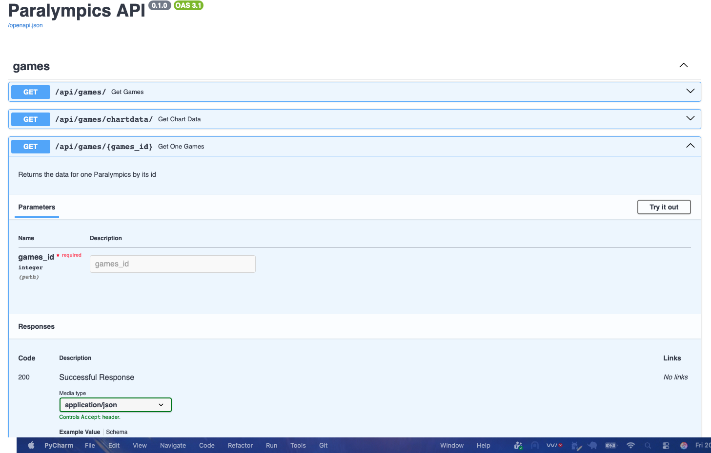

# 5. Routes for the Games table

## Decide on the routes

A REST API has resources. A resource is conceptual thing exposed via HTTP (e.g., games, teams,
countries).

A resource does not have to map to a single database table; though in the COMP0034 activities it
generally does.

For each resource, a REST API typically a set of routes (but does not have to). The table gives
an example based on the Games data in this Paralympics database.

| Db operation  | URL example                                                                                             | Response status code | Response body                                                                                                                                  |
|:--------------|:--------------------------------------------------------------------------------------------------------|:---------------------|:-----------------------------------------------------------------------------------------------------------------------------------------------|
| Read one row  | GET /api/games/{games_id}                                                                               | 200 OK               | The resource that has been fetched.                                                                                                            |
| Read all rows | GET /api/games/                                                                                         | 200 OK               | The resources that have been fetched.<br>May support (support filters/pagination/sorting).<br>Return empty list rather than 404 if no results. |
| Create row    | POST /api/games/                                                                                        | 201 Created          | A description of the created resource, e.g. JSON format of the created report                                                                  |
| Update row    | PUT /api/games/{games_id} replace the entire 'games'<br>PATCH /api/games/{games_id} for partial updates | 200 OK               | A description of the created resource, e.g. JSON format of the created report                                                                  |
| Delete row    | DELETE /api/games/{games_id}                                                                            | 204 No Content       |                                                                                                                                                |

Error [status codes](https://developer.mozilla.org/en-US/docs/Web/HTTP/Reference/Status) include:

- Not found from a GET request: 404 Not Found
- Validation error: 400 Bad Request
- Internal server error (often an app code issue): 500 Internal Server Error

This activity creates the GET routes only. POST, PUT, PATCH, DELETE are covered next week.

### Routes for the front end apps
For the front-end app we need the following routes:

- `GET {API_BASE_URL}/question` - get all questions
- `GET {API_BASE_URL}/question/{qid}` - get a question by its id
- `GET {API_BASE}/response/search?question_id={qid}` - get all responses for a given question id
- `GET {API_BASE}/all` - a route that combines data from Games, Host and Country
- `POST {API_BASE_URL}/question` - create a new question
- `POST {API_BASE_URL}/response` - create a new response for a question

Most REST API conventions recommend plural resource names because an endpoint represents a
collection of resources.

As responses are a sub-resource of questions then they would typically be structured as such.

A more conventional set of route names for the questions and responses would be:

- POST /questions
- GET /questions/{questionId}
- GET /questions/{questionId}/responses
- POST /questions/{questionId}/responses

**To avoid changing the front end app, the activity sticks to the original route names. This is not
best practice though so please consider this when you create your coursework!**

## Defining routers

In the first activity you created a route inside `main.py`. This works but to make the files
easier to manage, routes are often moved to separate modules and defined using `APIRouter`.

Create a new Python file in the `routes` package named `games_router.py`. This will have routes
associated with the data from the Games table.

You define a router using FastAPI's APIRouter. You then register this router against the app
instance
in `main.py`.

1. Define the router in `games_router.py`

    ```python
    from fastapi import APIRouter
    
    router = APIRouter()

    # A more typical prefix, avoided to keep consistency with the front end app
    # router = APIRouter(prefix="/api/games") 
    ```

2. Register the router in `main.py`

    ```python
    # Add this import near the top of your code
    from backend.routes import games_router
    
    # Register the router after you app = FastAPI() the CORSMiddleware is registered.
    app.include_router(games_router.router)
    ```

## Separating routes and database interaction

In COMP0035 coursework 2 many students designed the app structure with classes for routes that
called separate 'repository' service classes in a service layer.

You do not have to follow this pattern, however it is a common pattern to use so is adopted in the
following guidance.

If you do not want to follow the pattern, put the database queries in the routes and omit the
service layer. Skip to [Route without the service layer](#route-without-the-service-layer),
though note that full solutions for this approach are not given either here or in the tutor
solutions repository.

### Database service layer

Create a new module in the `services` package named `games_service.py`.

Create a `GamesService` class.

Add a method, `get_games_by_id`, to the class which:

- takes as its arguments the session dependency and the id of the Games to locate.
- returns a Games object.
- if the Games is not found, raises a fastapi HTTPException and returns a status code 404.

The code would look like this:

```python
class GamesService:

    @staticmethod
    def get_games_by_id(session: SessionDep, game_id: int) -> Games:
        """ Method to retrieve a game by its ID.
        Args:
            session: SQLModel session
            game_id: Games.id

        Returns:
            Games: Paralympic Games object

        Raises:
            HTTPException 404 Not Found
            """
        result: Optional[Games] = session.get(Games, game_id)
        if not result:
            raise HTTPException(status_code=404, detail=f"Games with id {game_id} not found")
        return result
```

Write the code yourself for a method to get all rows from the Games table.

Add a method, `get_games`, to the class which:

- takes as its arguments the session dependency.
- returns a list of Games objects.
- if none are found, return an empty list (and not a 404 exception)

### Routes

#### Route to get games by ID

Return to `games_router.py`.

Define a route to get a Games by its ID. The FastAPI documentation refers to this as a 'path';
another name for this is an 'endpoint'.

```python
service = GamesService()


@router.get("/{game_id}", response_model=Games)
def read_game(game_id: int, session: SessionDep):
    return service.get_game_by_id(session, game_id)
```

`@router` is the name that you gave to the router `router = APIRouter(prefix="/api/games")`

`.get` is the HTTP method.

`/{game_id}` is the path to this route. This is appended to the router path. If you ran the app on
localhost the full url would become `http://127.0.0.1:8000/api/games/{games_id}`.

`response_model=` is the Pydantic schema that describes what will be returned and applies any
validation. Currently, there is a single SQLModel class for Games in `models.py` so use that.
SQLModel extends Pydantic so acts as both SQLAlchemy class and a Pydantic schema. Next week
introduces multiple schemas for different purposes.

The function docstring will be included in the API documentation, so make it meaningful.

The function uses the method `get_game_by_id(session, game_id)` in the `GamesService` class you
created in the last step. The function handles the 404 error so you don't repeat that in the
route code.

Run the app.

Go to http://127.0.0.1:8000/api/docs. The docs are generated for you and rely on the Pydantic
models (SQLModel in this case), the Python type hints, and the docstrings for the route functions.

You should see the route you created. If you expand it, then select `Try it out`, enter `1` in the
`games_id` box and then press the blue `Execute` bar.



You should see the results and status code in the documentation window.

#### Route to get all Games

Write the code yourself.

The HTTP method is `.get`

The path is `/` (no optional parameter such as ID this time).

The response model is a list of Games `list[Games]`

The method to call is `.get_games` which takes a `SessionDep` as its argument.

Remember to check the docs route to try it out and check it works.

#### Route to get the data needed for the charts

The data for the charts you created in the front end app comes from the Games, Host and Country
tables.

Add a method to the GamesService class with the following:

```python
@staticmethod
def get_chart_data(session: SessionDep) -> list[dict[str, Any]]:
    """ Method to return all data from the paralympics database for the charts."""
    statement = select(
        Country.country_name,
        Games.event_type,
        Games.year,
        Games.start_date,
        Games.end_date,
        Host.place_name,
        Games.events,
        Games.sports,
        Games.countries,
        Games.participants_m,
        Games.participants_f,
        Games.participants,
        Host.latitude,
        Host.longitude,
    ).select_from(Games).join(Games.hosts).join(Country, Host.country_id == Country.id)

    result = session.exec(statement).all()
    data = [dict(row) for row in result]
    if not data:
        return []
    return data
```

Go to the `games_router.py` and add a route to get this data.

The route path must be `/all` to match the code in the front-end app.

There is a class named `Paralympics` that is not a database table in `models.py`. Use this in the
response model.

Use the method you created above to get and return the data.

## Route without the service layer

If you are not using the service layer, then the routes needs both the code for the route and the
code to query the database.

The `games_router.py` route to get a single Games by its ID could look like this:

```python
from fastapi import APIRouter, HTTPException
from sqlmodel import Session, select

from backend.models.models import Games
from backend.core.deps import SessionDep

router = APIRouter(prefix="/api/games")


@router.get("/{games_id}", response_model=Games)
def get_games_by_id(games_id: int, session: SessionDep):
    """
    Retrieve a single game from the database by ID.
    """
    # Query the database using the session dependency
    games = session.get(Games, game_id)

    # Handle the case of a 404 not found exception
    if games is None:
        raise HTTPException(
            status_code=404,
            detail=f"Game with id {games_id} not found"
        )

    # Return the instance of games, the response model applies validation
    return games
```

Add routes to:

- get all games
- get the chart data

Refer to the sections for the separate service and route layers and combine the code in your routes.

## More practice

To practice further, try adding GET routes for the question and response resources:

- GET /questions/{questionId}
- GET /questions/{questionId}/responses

[Next activity](6-end.md)

