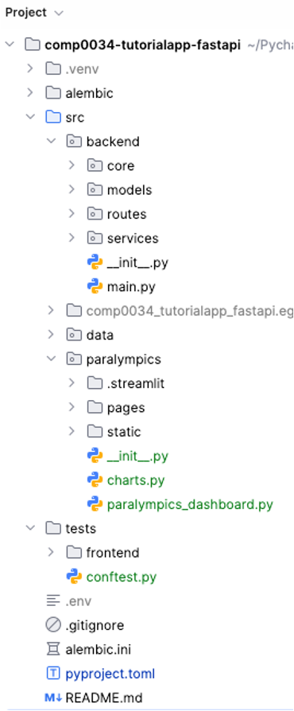

# 2. Full stack: frontend to backend

## What is full stack?

"Full stack" refers to all parts of a web application in a single code base.

The front end refers to the user facing components. In this module this is the Flask, Dash or
Streamlit app as covered in the first 5 weeks.

The back end refers to the database and logic components. In this module, this is the FastAPI REST
API covered in weeks 6 to 9.


Please note that there is
a [full stack FastAPI template in GitHub](https://github.com/fastapi/full-stack-fastapi-template).
You can refer to this, however, you will not be able to use their entire code since they use React
for the front end and Postgres for the database which are not to be used for COMP0034. Aspects you
might want to look at include routes, services, app config, models and schemas, authentication,
tests and GitHub Actions CI.

## Updating the front end app to use the backend app

The tutor solution implements the Streamlit frontend to the FastAPI backend. You can use any
of the three front end apps for this.

### Add the front end app code to your FastAPI repository

In the tutor solution this week, the folder structure now looks like this:



### Delete the temporary REST API

Remove the code to create the temporary REST API. Remove file `/data/api.py`.

### Update the routes in the front end app

Some of the routes have changed. Find and replace in your front end app code:

| Old                            | New                             |
|:-------------------------------|:--------------------------------|
| `f"{API_BASE}/question/{qid}"` | `f"{API_BASE}/questions/{qid}"` |
| `f"{API_BASE}/question"`       | `f"{API_BASE}/questions"`       |
| `f"{API_BASE}/response"`       | `f"{API_BASE}/responses"`       |

### Cross-Origin Resource Sharing (CORS)

[FastAPI defines CORS](https://fastapi.tiangolo.com/tutorial/cors/):

> When a frontend running in a browser has code that communicates with a backend, and the backend is
> in a different "origin" than the frontend.

> An origin is the combination of protocol (http, https), domain (myapp.com, localhost,
> localhost.tiangolo.com), and port (80, 443, 8080). So, all these are different origins:
> http://localhost
> https://localhost
> http://localhost:8080

> Even if they are all in localhost, they use different protocols or ports, so, they are different
"origins".

In FastAPI you provide a list of allowed "origins" to the backend app to authorise communication
with the frontend app using CORS Middleware.

In the Paralympics example this has already been added. In your coursework you will need to add it.

To use CORSMiddleware you:

- Import CORSMiddleware
- Create a list of allowed origins (as strings)
- Add it as a "middleware" to your FastAPI application
- You can also specify whether your backend allows:
  - Credentials (Authorization headers, Cookies, etc).
  - Specific HTTP methods (POST, PUT) or all of them with the wildcard "*".
  - Specific HTTP headers or all of them with the wildcard "*".

Find the code in `main.py`:

```python
app = FastAPI(
    title="Paralympics API",
    lifespan=lifespan,
    docs_url="/"
)

# Allow requests from front end apps
origins = [
    "http://localhost",
    "http://127.0.0.1",
    "http://localhost:8050",  # dash default
    "http://localhost:5000",  # flask default
    "http://localhost:8501",  # streamlit default
]

# Add CORSMiddleware to the app to register these origins
app.add_middleware(
    CORSMiddleware,
    allow_origins=origins,
    allow_credentials=True,
    allow_methods=["*"],
    allow_headers=["*"],
)
```

### Run the apps

Run the REST API: `fastapi dev src/backend/main.py`

Run the front end app to check that it functions. For example:
`streamlit run src/paralympics/paralympics_dashboard.py`

Since the new REST API routes return the same data as the temporary backend API did, then the
front end app should continue to work.

[Next activity](3-logging-custom-errors.md)