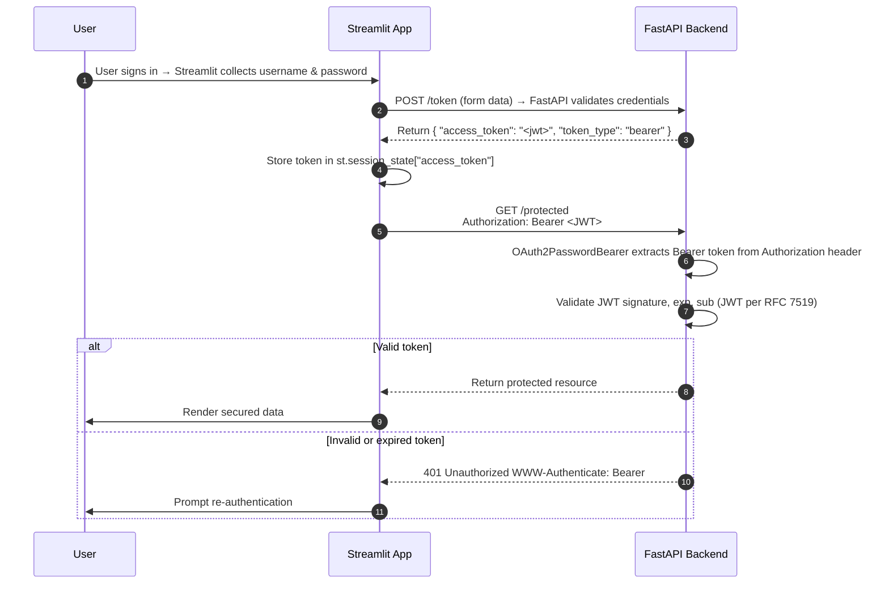

# 5. Authentication (optional)

This content is optional and only included as some students designed apps that rely on the user
being logged in e.g. for a customised experience.

If you have authentication on your app, make sure you seed the database with a username and
password and provide these in the coursework report so that your app can be run and accessed for
marking purposes.

Please do not implement authentication unless you need to. Including it does not imply any
extra marks and at worst can hinder marking.

## Overview

The authentication flow between frontend and backend apps works like this:



The steps in this activity add a login to the teacher page of the Streamlit Paralympics app so only
a logged-in user can add questions and answers. The solution is a simple implementation with
account creation and login only.

The solution is based on the FastAPI
documentation: [OAuth2 with Password (and hashing), Bearer with JWT tokens](https://fastapi.tiangolo.com/tutorial/security/oauth2-jwt/).

### OAuth2

[OAuth2](https://auth0.com/intro-to-iam/what-is-oauth-2) is a framework that lets apps access
resources on behalf of a user without ever seeing the user's password.

It uses the following role concepts:

- Resource Owner: The user or system that owns the protected resources and can grant access to
  them.  (FastAPI REST API app)
- Client: The client is the system that requires access to the protected resources. To access
  resources, the Client must hold the appropriate Access Token.  (Frontend app –
  Flask/Dash/Streamlit)
- Authorization Server: This server receives requests from the Client for Access Tokens and issues
  them upon successful authentication and consent by the Resource Owner. The authorization server
  exposes two endpoints: the Authorization endpoint, which handles the interactive authentication
  and
  consent of the user, and the Token endpoint, which is involved in a machine to machine
  interaction.  (REST API app)
- Resource Server: A server that protects the user’s resources and receives access requests from the
  Client. It accepts and validates an Access Token from the Client and returns the appropriate
  resources to it. (REST API app)

Client must acquire its own credentials, a client id and client secret, from the Authorization
Server to identify and authenticate itself when requesting an Access Token

Access requests are initiated by the Client, e.g., a mobile app, website, smart TV app, desktop
application, etc.

The token request, exchange, and response follow this general flow:

- The Client requests authorization (authorization request) from the Authorization server, supplying
  the client id and secret to as identification; it also provides the scopes and an endpoint URI (
  redirect URI) to send the Access Token or the Authorization Code to.
- The Authorization server authenticates the Client and verifies that the requested scopes are
  permitted.
- The Resource owner interacts with the Authorization server to grant access.
- The Authorization server redirects back to the Client with either an Authorization Code or Access
  Token, depending on the grant type, as it will be explained in the next section. A Refresh Token
  may also be returned.
- With the Access Token, the Client requests access to the resource from the Resource server.

### JSON Web Tokens (JWT)

JWT provides an authentication mechanism that can be used for login.

The user's state is stored inside the token on the client side instead of on the server.

Many web and mobile applications use JWT for authentication, for reasons including scalability (e.g.
stored on client not server, can load balance across servers) and device authentication.

The token structure is defined in [RFC 7519](https://www.rfc-editor.org/rfc/rfc7519); with
an [easier to read introduction here](https://jwt.io/introduction/).

The token has three parts: the Header, the Payload, and the Signature, separated by dots(.); i.e.
`Header.Payload.Signature`

- Header: the token type (JWT) and the algorithm used to sign the token
- Payload: the information to be transmitted
- Signature: key that is generated using the algorithm applied to the header and payload

## Add a simple login and apply to the teacher admin page

### Add a User model class and schemas

Add user class to `models.py`, for example:

```python
from pydantic import EmailStr


class User(SQLModel, table=True):
    id: Optional[int] = Field(default=None, primary_key=True)
    email: EmailStr
    hashed_password: str
```

You will now need to upgrade the database using alembic as you have added a new table. In the IDE
terminal type: `alembic revision -m "2_add_user" --autogenerate`

You then apply the change to the database using `alembic upgrade head`

Add schemas for the user, the following are just enough to support login and creating a new
user. You will need more if you want to support password resets, changing email, etc:

```python
class UserBase(SQLModel):
    email: EmailStr = Field(unique=True, index=True, max_length=255)


class UserCreate(SQLModel):
    email: EmailStr = Field(max_length=255)
    password: str = Field(min_length=8, max_length=128)


class Token(SQLModel):
    access_token: str
    token_type: str = "bearer"


class TokenPayload(SQLModel):
    sub: Optional[str] = None
```

### Storing passwords

The solution will use email and password. The password will be hashed before it is stored in the
database. Hashing is a more secure way to store passwords in a database rather than plain text. It
converts a plain text password into a sequence of bytes (just a string) that looks like gibberish.
Whenever you pass exactly the same content (exactly the same password) you get exactly the same
gibberish; but you cannot convert from the gibberish back to the password.

FastAPI tutorial uses pwdlib for hashing. Install it with the algorithms you want to use, e.g.
`pip install "pwdlib[argon2,bcrypt]"`

You now need to create functions to set and retrieve the password. Add a new module, e.g.
`src/backend/core/security.py` with the following:

```python
# Adapted from: https://github.com/fastapi/full-stack-fastapi-template/blob/master/backend/app/core/security.py
from pwdlib import PasswordHash
from pwdlib.hashers.argon2 import Argon2Hasher
from pwdlib.hashers.bcrypt import BcryptHasher

password_hash = PasswordHash(
    (
        Argon2Hasher(),
        BcryptHasher(),
    )
)


def verify_password(plain_password: str, hashed_password: str) -> tuple[bool, str | None]:
    return password_hash.verify_and_update(plain_password, hashed_password)


def get_password_hash(password: str) -> str:
    return password_hash.hash(password)
```

### Add configuration to support JWT

Update the `.env` and `config.py` files with the following:

```python
# .env
# Add the following to the existing file
# ---------------------------------------
ALGORITHM = HS256
ACCESS_TOKEN_EXPIRES = 30


# /src/backend/core/config.py
# add secret_key and algorithm to the existing file
# -------------------------------------------------
class Settings(BaseSettings):
    db_name: str
    db_driver: str
    secret_key: str = secrets.token_urlsafe(32)
    algorithm: str
    access_token_expires: int
```

### Code to create the JWT

The backend app needs to be able to create a token. Add this to the same module you added the
password functions.

```python
from datetime import datetime, timedelta, timezone
from typing import Any

import jwt

from backend.core.config import get_settings


def create_access_token(subject: str | Any) -> str:
    """ Create access token

    Args:
    subject: Identifier for the token subject \(for example, a user ID\).

    Returns:
       Encoded JWT access token.
    """
    settings = get_settings()
    expire = datetime.now(timezone.utc) + timedelta(minutes=settings.access_token_expires)
    to_encode = {"exp": expire, "sub": str(subject)}
    encoded_jwt = jwt.encode(to_encode, settings.secret_key, algorithm=settings.algorithm)
    return encoded_jwt
```

### Add code to create a new user and authenticate for login

You don't have to create a separate service, the code could be in the route code or in the
security module. For consistency with the quiz and games services, add the following to
`backend/services/auth_service.py`.

`create_user` will receive the email and plain text password that the user will enter in the
frontend app. It will use the `get_password_hash()` function created earlier and then will create
a new User object and save it to the database.

`get_user_by_email()` will be used to find the user in the database as part of the login process.
Email addresses must be unique.

`authenticate()` takes the email and password from the frontend app login, finds if the user
exists using the above function, and then uses the `verify_password()` to check if the plain text
password matches with the hashed value stored in the database.

```python
# Copied and adapted from https://github.com/fastapi/full-stack-fastapi-template/blob/master/backend/app/crud.py

from sqlmodel import select

from backend.core.deps import SessionDep
from backend.core.security import get_password_hash, verify_password
from backend.models.models import User
from backend.models.schemas import UserCreate


class AuthService:
    # Dummy hash to use for timing attack prevention when user is not found
    # This is an Argon2 hash of a random password, used to ensure constant-time comparison
    dummy_hash = "$argon2id$v=19$m=65536,t=3,p=4$MjQyZWE1MzBjYjJlZTI0Yw$YTU4NGM5ZTZmYjE2NzZlZjY0ZWY3ZGRkY2U2OWFjNjk"

    @staticmethod
    def create_user(session: SessionDep, user_create: UserCreate) -> User:
        db_obj = User.model_validate(
            user_create, update={"hashed_password": get_password_hash(user_create.password)}
        )
        session.add(db_obj)
        session.commit()
        session.refresh(db_obj)
        return db_obj

    @staticmethod
    def get_user_by_email(session: SessionDep, email: str) -> User | None:
        statement = select(User).where(User.email == email)
        session_user = session.exec(statement).first()
        return session_user

    def authenticate(self, *, session: SessionDep, email: str, password: str) -> User | None:
        db_user = self.get_user_by_email(session=session, email=email)
        if not db_user:
            # Prevent timing attacks by running password verification even when user doesn't exist
            # This ensures the response time is similar whether or not the email exists
            verify_password(password, self.dummy_hash)
            return None
        # verify_password returns: (is_valid: bool, updated_hash: str | None)
        is_valid, updated_hash = verify_password(password, db_user.hashed_password)
        if not is_valid:
                return None
        return db_user
```

### Routes

Add a new router, e.g. `/backend/routes/auth_router.py`.

Include routes to handle:

- login: take the username and password and use the service to find the user. If the user exists and
  the password is correct, then create a token using the function in security.
- register: take the username and plain text password and use the service to add the new user to the
  database.

```python
# Copied and adapted from 
# https://github.com/fastapi/full-stack-fastapi-template/blob/master/backend/app/api/routes/login.py
# https://github.com/fastapi/full-stack-fastapi-template/blob/master/backend/app/api/routes/users.py

from typing import Annotated, Any

from fastapi import APIRouter, Depends, HTTPException
from fastapi.security import OAuth2PasswordRequestForm

from backend.core import security
from backend.core.deps import CurrentUser, SessionDep
from backend.models.schemas import Token, UserCreate, UserRead
from backend.services.auth_service import AuthService

router = APIRouter(tags=["login"])
crud = AuthService()


@router.post("/login/access-token")
def login_access_token(
        session: SessionDep, form_data: Annotated[OAuth2PasswordRequestForm, Depends()]
) -> Token:
    """
    OAuth2 compatible token login, get an access token for future requests
    """
    # Use email as the username and the password to log them in and return the user
    user = crud.authenticate(
        session=session, email=form_data.username, password=form_data.password
    )
    # If the user is found, then generate a token
    if not user:
        raise HTTPException(status_code=400, detail="Incorrect email or password")
    return Token(
        access_token=security.create_access_token(user.id)
    )


@router.post("/login/test-token", response_model=UserRead)
def test_token(current_user: CurrentUser) -> Any:
    """
    Test access token
    """
    return current_user


@router.post("/signup", response_model=UserRead)
def register_user(session: SessionDep, user_in: UserCreate) -> Any:
    """
    Create new user without the need to be logged in.
    """
    user = crud.get_user_by_email(session=session, email=user_in.email)
    if user:
        raise HTTPException(
            status_code=400,
            detail="The user with this email already exists in the system",
        )
    try:
        user_create = UserCreate.model_validate(user_in)
    except ValueError as e:
        raise HTTPException(status_code=422, detail=f"Invalid email or password {str(e)}")
    user = crud.create_user(session=session, user_create=user_create)
    return user
```

Now register the `auth_router` for the app by adding it in `backend/main.py`, e.g.:

```python
    # Register the routers
    app.include_router(games_router.router)
    app.include_router(quiz_router.router)
    app.include_router(auth_router.router)
```

### Modify routes to require a user to have a token

Modify the routes to create a new question and response so that only authenticated users can
access these.

A new dependency is required: `current_user: CurrentUser`

Create the new dependency in `/backend/core/deps.py`. This checks if the token is present and
valid and if so, finds the user associated with that token.

```python
from typing import Annotated

import jwt
from fastapi import Depends, HTTPException, status
from fastapi.security import OAuth2PasswordBearer
from jwt.exceptions import InvalidTokenError
from pydantic import ValidationError
from sqlmodel import Session

from backend.core.config import settings
from backend.models.models import User
from backend.models.schemas import TokenPayload

# Database dependency omitted here but should still be in your code

# -----------------------------------
# Add the following auth dependencies
# -----------------------------------

reusable_oauth2 = OAuth2PasswordBearer(tokenUrl="/login/access-token")
TokenDep = Annotated[str, Depends(reusable_oauth2)]


def get_current_user(session: SessionDep, token: TokenDep) -> User:
    """ Get the current authenticated user from JWT token.

        Args:
            session: Database session dependency
            token: Dependency, JWT token from OAuth2 authentication

        Returns:
            User: The authenticated user object

        Raises:
            HTTPException: If token is invalid (403) or user not found (404)
        """
    try:
        payload = jwt.decode(
            token,
            settings.secret_key,
            algorithms=[settings.algorithm]
        )
        token_data = TokenPayload(**payload)
    except (InvalidTokenError, ValidationError):
        raise HTTPException(
            status_code=status.HTTP_403_FORBIDDEN,
            detail="Could not validate credentials",
        )
    user = session.get(User, token_data.sub)
    if not user:
        raise HTTPException(status_code=404, detail="User not found")
    return user


CurrentUser = Annotated[User, Depends(get_current_user)]
```

Then modify the routes to use this:

```python
from backend.core.deps import CurrentUser, SessionDep


# Route now protected by login
@router.post("/questions", response_model=QuestionRead)
def create_question(session: SessionDep, current_user: CurrentUser, question_data: QuestionCreate):
    """ Creates a new question  """
    if current_user:
        new_question = crud.create_question(session, question_data)
        return new_question
    if not current_user:
        raise HTTPException(status_code=401,
                            detail="You must be logged in to create a new question.")


# Route now protected by login
@router.post("/responses", response_model=ResponseRead)
def create_response(session: SessionDep, current_user: CurrentUser, create_data: ResponseCreate):
    """ Creates a new response to a question  """
    if current_user:
        new_question = crud.create_response(session, create_data)
        return new_question
    if not current_user:
        raise HTTPException(status_code=401,
                            detail="You must be logged in to create a new question.")
```

### Add login to the frontend app

This example uses Streamlit.

You will add code to handle sign up and login for the `/paralympics/pages/teacher_admin.py` page.

Add two functions near the top of the code:

- handle sign up to allow a user to create an account which passes the email address and password to
  the REST API route `/signup`
- handle login which passes the email address and password to the REST API route
  `/login/access-token`

```python
def login(email, password):
    """ Login to Teacher Admin.
    Args:
        email (str): Username
        password (str): Password

    Returns:
        access_token (str): Access Token
    """
    # The token route uses 'username' rather than 'email'
    data = {"username": email, "password": password}
    resp = requests.post(f"{API_BASE}/login/access-token", data=data)
    if resp.status_code == 200:
        return resp.json()["access_token"]
    return None


def signup(email, password):
    data = {"email": email, "password": password}
    resp = requests.post(f"{API_BASE}/signup", json=data)
    if resp.status_code == 201:
        return "Account created. You can now log in."
    return f"Account could not be created. {resp.json()['detail']}"
```

Before you display the new question form, display a login / signup form (you could add more
sophisticated logic to separate these if you wish).

- Add token to the session state with a value of None if the token doesn't already exist.
- If the token is None then the user is not authenticated so present the options to login/signup.
  This has a single form for both but with two buttons. On submission of the button, these call the
  functions you just added in the previous step (login or signup).
- If there is a valid token then the user is logged in so let them access the form to add a new
  question.

```python
# Add token as to the session state with a value of None if it doesn't already exist
if "token" not in st.session_state:
    st.session_state["token"] = None

# If the token is None then the user is not authenticated so present the options to login/signup
# This has a single form for both but with two buttons
# On submission of the button, these call the functions you just added in the previous step
if st.session_state["token"] is None:
    with st.form("auth_form", clear_on_submit=False):
        st.title("Login / Signup")
        username = st.text_input("Email")
        password = st.text_input("Password", type="password")
        login_submit = st.form_submit_button("Login")
        signup_submit = st.form_submit_button("Signup")

        if login_submit:
            token = login(username, password)
            if token:
                st.session_state["token"] = token
                st.rerun()
            else:
                st.error("Invalid login")

        if signup_submit:
            response = signup(username, password)
            st.write(response)

# If there is a valid token then the user is logged in so let them access the form to add a new question
if st.session_state["token"]:
    # Form UI now goes here
    with st.form("question_form"):
        st.header("Create Question")
        # etc
```

The final change is to pass the token in the headers of the HTTP requests to . This is used by the
`current_user: CurrentUser` dependency you added to the routes.

Find the following section of code in the `process_form()` function and add the indicated header
info:

```python

try:
    # Add the headers here and in the following line use the headers=headers
    headers = {"Authorization": f"Bearer {st.session_state['token']}"}
    response = requests.post(f"{API_BASE}/questions", json=payload, headers=headers)

    response.raise_for_status()
    question_id = response.json()["id"]

    for idx, r in enumerate(responses, start=1):
        r["question_id"] = question_id

        # Add the headers=headers to this request as well
        resp = requests.post(f"{API_BASE}/responses", json=r, headers=headers)
```

## Try it out

You should now have just enough code to create and account, login and add a new question with
responses.

Run the REST API.

Run the Streamlit app.

Go to the teacher admin page.

Use the login/signup box and first sign up.

If signup is successful then login.

Once logged in you should then be able to add a new question and 4 responses.

## Improvements

The steps in this activity added a login to the teacher page of the Streamlit Paralympics app so
only
a logged-in user can add questions and answers.

The solution is a simple implementation with account creation and login only.

It does not include logout, password reset, using reset tokens by email etc.

There is a fuller solution in the FastAPI Full Stack repo in GitHub and many examples of tutorials
online.

[Next activity](6-end.md)

