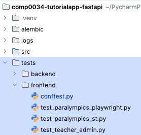

# 1. Introduction

These activities cover:

- using the FastAPI Test Client with pytest assertions
- handling databases changes in tests

Other relevant test topics are included in lectures and activities in COMP0035 and in COMP0034 week
4:

- types of testing
- naming conventions for test files, folders and functions
- Act > Arrange > Assert, Given > When > Then to structure and specify tests
- Pytest: assertions, fixtures
- Unit testing with pytest
- Continuous Integration with GitHub Actions
- Coverage
- Integration testing from the browser using Playwright or Selenium
- Framework specific tests: Flask route testing, Streamlit `TestApp`, Dash `dash_duo` fixture

## Set up

1. Install pytest and httpx: `pip install httpx pytest`

## Use the code from the week 8 branch

You need to either have completed the activities for week 8, or make sure you are using
the [Week 8 branch](https://github.com/nicholsons/comp0034-tutorialapp-fastapi/tree/week8) version of the code for the testing activities.

## Pytest config

Pytest can be configured in `pyproject.toml`.

For example:

```yaml
[ tool.pytest ]
  addopts = [
  "-ra", #-ra show extra test summary (all except passed)
  "-v", # -v increase verbosity
  "--import-mode=importlib", # import-mode is recommended in the pytest documentation
  "--cov=src",
  "--cov-report=html",
]
  testpaths = ["tests"]
```

## Test directory

Choose a
standard [test layout](https://docs.pytest.org/en/stable/explanation/goodpractices.html#choosing-a-test-layout)
that pytest recognises. The Paralympics example uses the src layout.

In the root of the project create a `/tests` directory.

Within tests, create subdirectories for the two apps.

Here's a snapshot of my code:



## Reference documentation

Library documentation:

- [FastAPI Testing/](https://fastapi.tiangolo.com/tutorial/testing/)
- [Test Applications with FastAPI and SQLModel](https://sqlmodel.tiangolo.com/tutorial/fastapi/tests/#test-applications-with-fastapi-and-sqlmodel)

External tutorials:

- [Ssali Jonathan - video tutorial + GitHub code - full explanation of testing a FastAPI app](https://www.youtube.com/watch?v=gop9Or2V_80)
- [Alex Jacobs - covers testing authentication](https://alex-jacobs.com/posts/fastapitests/)
- [Pytest with Eric - includes fixture for rollback of database changes using SQLAlchemy](https://pytest-with-eric.com/pytest-advanced/pytest-fastapi-testing/#Writing-Tests-with-Pytest)

Other:

- [FastAPI discussion - fixture for rollback of database changes using SQLModel](https://github.com/fastapi/sqlmodel/discussions/940)
- [FastAPI best practices - testing section](https://auth0.com/blog/fastapi-best-practices/#Testing)