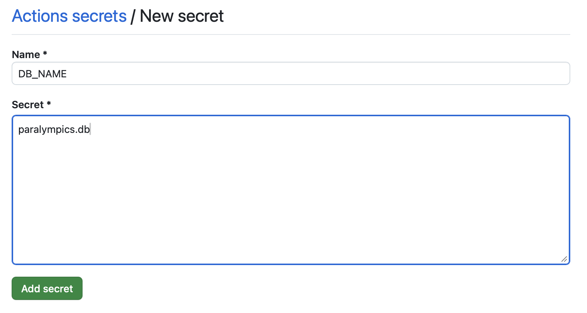
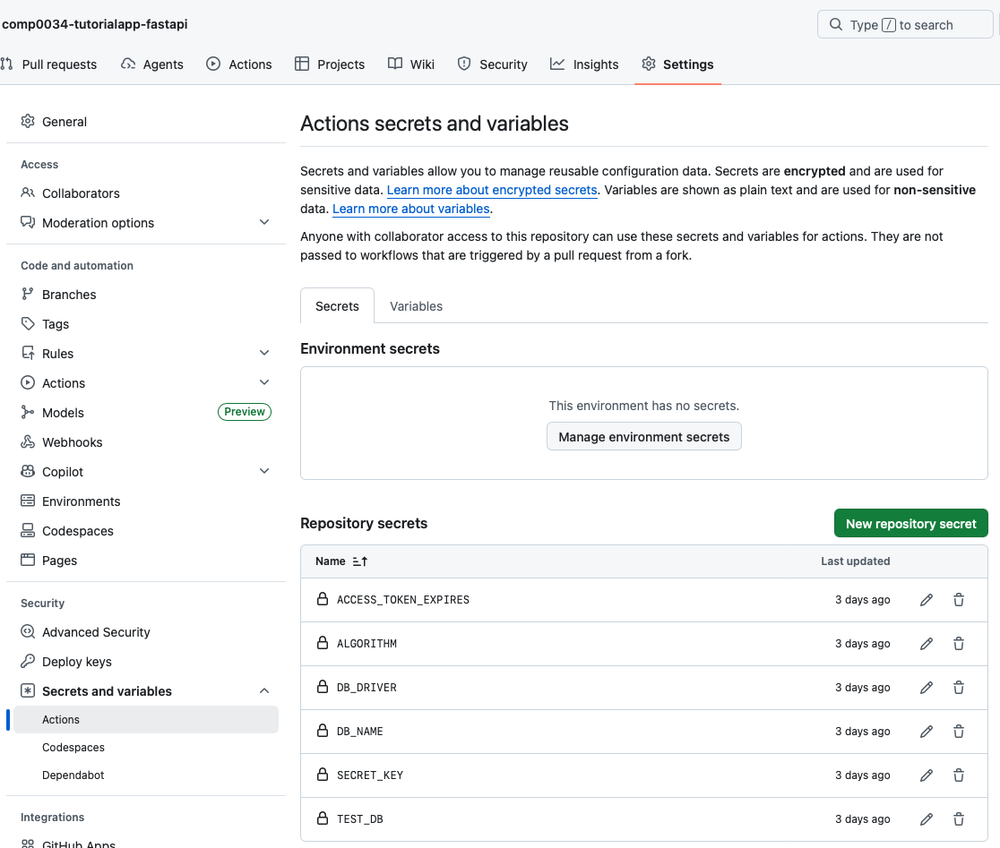
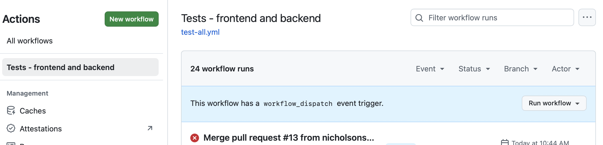

# 5. Continuous Integration (CI) in GitHub Actions

Setting up GitHub Actions was covered in COMP0035. This was also covered in COMP0034 Week 5 for the
front end testing. This activity does not cover the whole explanation of a GitHub Actions workflow
only the changes needed for the FastAPI app.

There are two changes you need to make:

1. Add the variables from `.env` as secret variables in GitHub
2. Modify the workflow to use these variables

## Add the variables from `.env` to GitHub

You don't want to put the `.env` file in GitHub, so you need an alternate way to access those
variables. You can store information in variables in the repository as documented in this
[GitHub guide](https://docs.github.com/en/actions/how-tos/write-workflows/choose-what-workflows-do/use-variables).

In GitHub in the repository, select the Settings gear icon.

In the left menu, scroll down to find 'Secrets and variables', expand that and select Actions.

I added them as Secrets using the green New repository secret button.

Complete the form with the variable name and its value
e.g. 

I added one for each of the values in my .env file:



## Modify the workflow .yml to use the variables

This is my current workflow file that just runs the tests for both apps (i.e. linting not included
in the current workflow).

The sections you need to add are:

- the `env` section at the start of the build
- the run step that recreates a `.env` file from these values before running pytest

```yaml
name: Tests - frontend and backend

on:
  push:
    branches: [ "week9", "master" ]
  workflow_dispatch:

permissions:
  contents: read

jobs:
  build:

    runs-on: ubuntu-latest

    env:
      TEST_DB: ${{ secrets.TEST_DB }}
      DB_DRIVER: ${{ secrets.DB_DRIVER }}
      ALGORITHM: ${{ secrets.ALGORITHM }}
      ACCESS_TOKEN_EXPIRES: ${{ secrets.ACCESS_TOKEN_EXPIRES }}
      DB_NAME: ${{ secrets.DB_NAME }}
      SECRET_KEY: ${{ secrets.SECRET_KEY }}

    steps:
      - uses: actions/checkout@v6
      - name: Set up Python 3.12
        uses: actions/setup-python@v6
        with:
          python-version: "3.12"
      - name: Install dependencies
        run: |
          python -m pip install --upgrade pip
          pip install -e .
      - name: Ensure browsers are installed
        run: python -m playwright install --with-deps
      - name: Create .env file for testing
        run: |
          cat > .env << EOF
          DB_DRIVER=${{ env.DB_DRIVER }}
          DB_NAME=${{ env.DB_NAME }}
          TEST_DB=${{ env.TEST_DB }}
          ALGORITHM=${{ env.ALGORITHM }}
          ACCESS_TOKEN_EXPIRES=${{ env.ACCESS_TOKEN_EXPIRES }}
          SECRET_KEY=${{ env.SECRET_KEY }}
          EOF
      - name: Test with pytest
        run: |
          pytest
```

The `workflow_dispatch:` allows you to manually trigger the workflow from GitHub i.e. you don't have
to push a change to the repository to trigger the workflow. This is not essential; it was 
useful to help debug issues with the workflow.



[Next activity](6-auth-tests.md)
